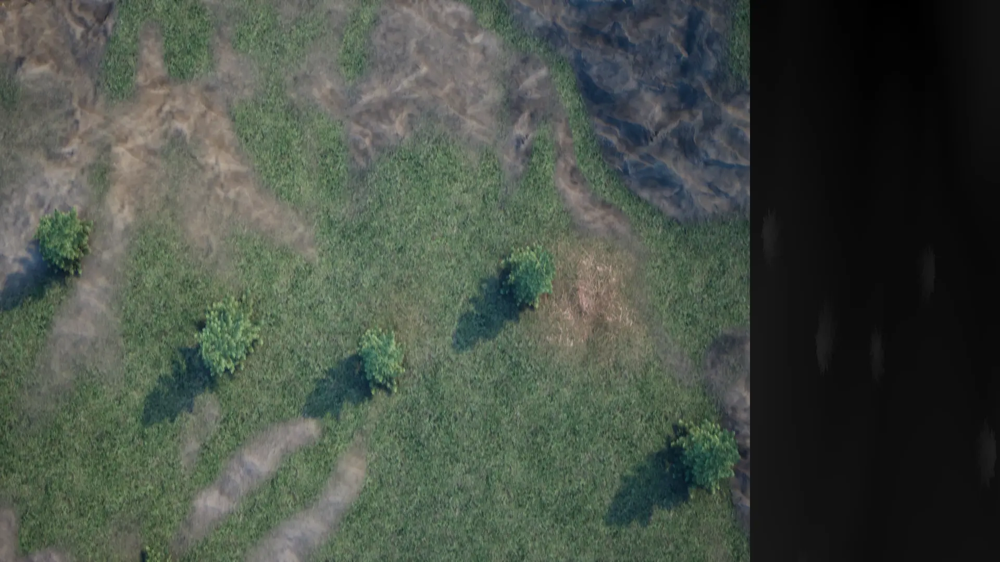

## Spot Invaders

This is a game submitted to Vibe Jam 2026. As with most big jams, there are a ton of beautiful, great games that people put a lot of love into. So, what makes this game different?

One big thing. The graphics are done in a very different way, built around a prerendered video that also contains depth information:

The video has 1440x1080 of actual graphics, which are expanded out to 16:9 ratio on playback, and 480x1080 of depth information. During playback, this depth information is tested using a special algorithm to see if the player is abruptly changing depth upwards to determine collision.

More about this later, but that's the basic idea!